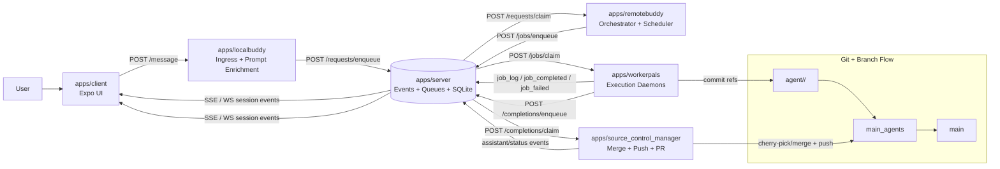
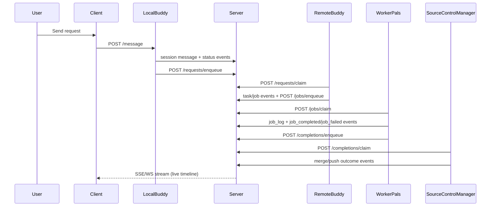

# Push Pals

Multi-device, always-on, multi-agent coding with clear orchestration and auditability.

## Overview

Push Pals runs a small software "team" around your repository:

- `apps/client`: chat UI (Expo web/mobile)
- `apps/server`: event hub + persistence + queues (SQLite)
- `apps/localbuddy`: `LocalBuddy` HTTP ingress + prompt enhancement
- `apps/remotebuddy`: `RemoteBuddy` orchestrator and scheduler
- `apps/workerpals`: `WorkerPals` execution daemons (host or Docker/OpenHands)
- `apps/source_control_manager`: `SourceControlManager` merge/push daemon

## Current Architecture

## Architecture Diagram

### End-to-end system view



### Communication model (event-driven)



### Fast path (chat and status)

1. Client sends message to `LocalBuddy` (`POST /message`).
2. LocalBuddy emits immediate user/session events through `CommunicationManager`.
3. LocalBuddy enriches prompt with repo context and enqueues request (`/requests/enqueue`).
4. RemoteBuddy claims request (`/requests/claim`), plans, and emits progress events.
5. Client receives all updates from server event stream (`SSE` or `WS`) and re-renders incrementally.

### Slow path (execution and integration)

1. RemoteBuddy schedules WorkerPal jobs (`/jobs/enqueue`), optionally targeting an idle WorkerPal.
2. WorkerPals claim jobs (`/jobs/claim`), execute in isolated worktrees (and Docker when enabled).
3. For mutating work, WorkerPals create commits on per-job branches: `agent/<workerId>/<jobId>`.
4. WorkerPals enqueue completions (`/completions/enqueue`).
5. SourceControlManager claims completions (`/completions/claim`), cherry-picks/merges into integration branch (`main_agents` by default), runs checks, pushes integration branch, and can auto-open/reuse a PR from integration branch to base branch for human review.

## Communication Model

`packages/shared/src/communication.ts` provides a shared `CommunicationManager` used by LocalBuddy, RemoteBuddy, and SourceControlManager.

This keeps session messaging consistent:

- user messages
- assistant messages
- task lifecycle (`task_created`, `task_started`, `task_progress`, ...)
- job lifecycle (`job_claimed`, `job_completed`, `job_failed`)
- integration status (SourceControlManager merge/push success/failure)

## Branching Model

- `main` is the source-of-truth branch.
- Integration branch defaults to `main_agents` (`PUSHPALS_INTEGRATION_BRANCH`).
- Integration branch upstream can track `origin/main` (`PUSHPALS_INTEGRATION_BASE_BRANCH=main`).
- Worker branches are ephemeral and namespaced: `agent/<workerId>/<jobId>`.
- SourceControlManager serializes integration into `main_agents` and pushes it.

## Isolation Model

- Worker execution uses isolated git worktrees under `.worktrees/`.
- Docker worker mode isolates runtime and toolchain per job container.
- SourceControlManager uses a dedicated worktree by default:
  - `.worktrees/source_control_manager`
- Startup refuses running SourceControlManager directly in your active workspace.

## Startup

Use:

```bash
bun run start
```

Optional clean run:

```bash
bun run start -c
```

`-c`/`--clean` removes runtime state from `PUSHPALS_DATA_DIR` (default `outputs/data`) before startup.

`scripts/start.ts` preflights:

- LLM endpoint reachability (fails fast with clear error if model server is down)
- optional local model-server auto-start (LM Studio headless)
- integration branch existence/bootstrapping
- integration branch sync with base branch (`main_agents` <= `main` by default) before launching RemoteBuddy
- git auth requirements for push flows
- SourceControlManager dedicated worktree
- worker Docker image existence (auto-build if missing)

Then it starts full dev stack via `dev:full`.

## Key Scripts

- `bun run dev:full`: full local stack
- `bun run workerpals:only:docker`: WorkerPal in strict Docker mode
- `bun run source_control_manager:only`: SourceControlManager daemon
- `bun run source_control_manager:only:dev`: same, with clean-check bypass

## Core Environment Variables

See `.env.example` for full details. Most important:

- `PUSHPALS_SESSION_ID`
- `PUSHPALS_AUTH_TOKEN`
- `PUSHPALS_INTEGRATION_BRANCH` (default `main_agents`)
- `PUSHPALS_INTEGRATION_BASE_BRANCH` (default `main`)
- `PUSHPALS_SYNC_INTEGRATION_WITH_MAIN` (default on during `bun run start`)
- `SOURCE_CONTROL_MANAGER_MAIN_BRANCH`
- `SOURCE_CONTROL_MANAGER_REPO_PATH`
- `SOURCE_CONTROL_MANAGER_DISABLE_AUTO_PR` (set `1` to disable auto-PR)
- `SOURCE_CONTROL_MANAGER_PR_BASE_BRANCH` (default `main`)
- `SOURCE_CONTROL_MANAGER_PR_DRAFT`
- `PUSHPALS_GIT_TOKEN` / `GITHUB_TOKEN` / `GH_TOKEN` (or authenticated `gh` CLI via `gh auth login` for auto-PR fallback)
- `REMOTEBUDDY_MAX_WORKERPALS`
- `REMOTEBUDDY_AUTO_SPAWN_WORKERPALS`
- `REMOTEBUDDY_WAIT_FOR_WORKERPAL_MS`
- `WORKERPALS_EXECUTOR` (`openhands` default)
- `WORKERPALS_DOCKER_IMAGE`
- `WORKERPALS_REQUIRE_DOCKER`
- `WORKERPALS_DOCKER_NETWORK_MODE` (default `bridge`; required for containerized access to host LLM endpoints)
- `PUSHPALS_WORKER_IMAGE_REBUILD` (`auto` default; auto rebuild when worker image inputs change)

LLM defaults:

- Supported backends are `lmstudio` and `ollama`
- Canonical per-service LLM config:
  - LocalBuddy: `LOCALBUDDY_LLM_BACKEND`, `LOCALBUDDY_LLM_ENDPOINT`, `LOCALBUDDY_LLM_MODEL`, `LOCALBUDDY_LLM_API_KEY`
  - RemoteBuddy: `REMOTEBUDDY_LLM_BACKEND`, `REMOTEBUDDY_LLM_ENDPOINT`, `REMOTEBUDDY_LLM_MODEL`, `REMOTEBUDDY_LLM_API_KEY`
  - WorkerPal/OpenHands: `WORKERPALS_LLM_BACKEND`, `WORKERPALS_LLM_ENDPOINT`, `WORKERPALS_LLM_MODEL`, `WORKERPALS_LLM_API_KEY`
- For OpenHands/LiteLLM, WorkerPals auto-qualifies plain model names:
  - `openai/<model>` for LM Studio/OpenAI-compatible backends
  - `ollama/<model>` for Ollama backends
- OpenHands task message shaping defaults to instruction-only to avoid 4k-context overflow:
  - `WORKERPALS_OPENHANDS_TASK_PROMPT_MODE=none` (default)
  - set `WORKERPALS_OPENHANDS_TASK_PROMPT_MODE=compact` to prepend `prompts/workerpals/openhands_task_execute_system_prompt.md`
- Large OpenHands instructions can be file-handoffed to keep initial prompts short:
  - `WORKERPALS_OPENHANDS_LARGE_INSTRUCTION_CHARS=1800` (default)
  - when exceeded, WorkerPals writes full text to `workspace/workerpal_requests/*` and tells OpenHands to read it first
- OpenHands agent prompt profile can be minimized for local 4k-context models:
  - `WORKERPALS_OPENHANDS_PROMPT_PROFILE=minimal` (default behavior for local endpoints)
  - `WORKERPALS_OPENHANDS_PROMPT_PROFILE=default` to use OpenHands built-in templates
- `bun run start` preflights LLM connectivity and can auto-start LM Studio headless mode for localhost endpoints
- Ollama is supported but is not auto-started by `bun run start`; run Ollama separately
- LM Studio startup controls:
  - `PUSHPALS_AUTO_START_LMSTUDIO=1` (default on)
  - `PUSHPALS_LMSTUDIO_CLI=lms`
  - `PUSHPALS_LMSTUDIO_PORT` (optional; defaults from `REMOTEBUDDY_LLM_ENDPOINT`)
  - `PUSHPALS_LMSTUDIO_START_ARGS` (optional extra args for `lms server start`)
  - `PUSHPALS_LMSTUDIO_READY_TIMEOUT_MS` (default `120000`)

## Repo Layout

- `apps/server`: HTTP API, sessions, queues, worker heartbeats
- `apps/client`: chat UI + event subscription
- `apps/localbuddy`: LocalBuddy prompt ingestion/enrichment
- `apps/remotebuddy`: RemoteBuddy planning, scheduling, queue orchestration
- `apps/workerpals`: WorkerPals execution, commits, completion enqueue
- `apps/source_control_manager`: SourceControlManager integration pipeline
- `packages/protocol`: shared event/request/response schema
- `packages/shared`: shared repo helpers + `CommunicationManager`

## Status

Under active development.
