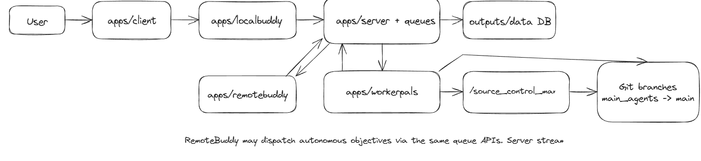
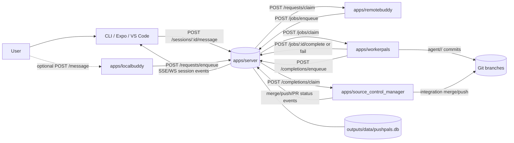

# PushPals

PushPals is a human-guided and autonomous AI coding helper that runs as a multi-service local system around your repository. It combines chat-style interaction, strict planning, delegated execution, and controlled git integration with auditability built in.

## Intent

PushPals is designed for two modes that can coexist in one runtime:

- Human-driven mode: you ask for work in chat, the system plans and executes code changes safely.
- Autonomous mode: `RemoteBuddy` periodically proposes and dispatches bounded maintenance objectives (when policy and eligibility gates allow).

Both modes flow through the same queues, events, and integration pipeline so behavior is observable and debuggable.

## Architecture Visuals

- Editable Excalidraw overview: [`docs/architecture.excalidraw`](docs/architecture.excalidraw)
- Detailed accessible SVG: [`docs/architecture.svg`](docs/architecture.svg)

Both representations describe the same runtime topology and are maintained together; the SVG and PNG include additional operational annotations.

- Raster preview/fallback:



- Mermaid runtime flow:


```mermaid
flowchart LR
  U[User] --> C[CLI / Expo / VS Code]
  C -->|POST /sessions/:id/message| S[(apps/server)]
  S -->|SSE/WS session events| C
  U -. optional POST /message .-> L[apps/localbuddy]
  L -->|POST /requests/enqueue| S

  S -->|POST /requests/claim| R[apps/remotebuddy]
  R -->|POST /jobs/enqueue| S
  S -->|POST /jobs/claim| W[apps/workerpals]
  W -->|POST /jobs/:id/complete or fail| S
  W -->|POST /completions/enqueue| S

  S -->|POST /completions/claim| M[apps/source_control_manager]
  M -->|merge/push/PR status events| S

  S --- DB[(outputs/data/pushpals.db)]
  W -->|agent/<worker>/<job> commits| G[(Git branches)]
  M -->|integration merge/push| G
```

## Services and Responsibilities

PushPals keeps coordination, planning, execution, and publication separate. The
`Owns` column identifies the authoritative component for each responsibility.

| Component                                                         | Owns                                                         | Main handoff                                                          | Guide                                                           |
| ----------------------------------------------------------------- | ------------------------------------------------------------ | --------------------------------------------------------------------- | --------------------------------------------------------------- |
| Expo client (`apps/client`)                                       | Mission-control UI and live projections                      | User actions and Server events -> visible session/queue state         | [Client surfaces](docs/wiki/09-client-surfaces.md)              |
| VS Code client (`apps/vscode-client`)                             | Editor UI and local stack controls                           | Editor prompts -> Server session ingress; controls -> local services  | [Client surfaces](docs/wiki/09-client-surfaces.md)              |
| Terminal CLI (`packages/cli`)                                     | Repo-aware terminal ingress and packaged runtime supervision | Terminal prompt -> Server session ingress; runtime health -> operator | [CLI surface](docs/wiki/09-client-surfaces.md)                  |
| LocalBuddy (`apps/localbuddy`)                                    | Optional fast ingress and lightweight replies                | `POST /message` -> local answer or queued request                     | [LocalBuddy](docs/wiki/05-localbuddy.md)                        |
| Server (`apps/server`)                                            | Durable sessions, queues, shared memory, and broker state    | API mutations -> persisted state, claims, snapshots, and events       | [Server control plane](docs/wiki/04-server-control-plane.md)    |
| RemoteBuddy (`apps/remotebuddy`)                                  | Planning, request orchestration, and autonomy                | Claimed request -> direct reply or scoped `task.execute` job          | [RemoteBuddy](docs/wiki/06-remotebuddy.md)                      |
| WorkerPals (`apps/workerpals`)                                    | Isolated execution, validation, and candidate commits        | Claimed job -> logs and completion candidate                          | [WorkerPals](docs/wiki/07-workerpals.md)                        |
| SourceControlManager (`apps/source_control_manager`)              | Trusted validation and publication policy                    | Completion candidate -> integrated commit or PR outcome               | [SourceControlManager](docs/wiki/08-source-control-manager.md)  |
| Protocol/shared packages (`packages/protocol`, `packages/shared`) | Wire contracts and reusable infrastructure                   | Typed payloads/configuration -> consistent service behavior           | [Shared packages](docs/wiki/10-shared-packages-and-protocol.md) |

## Quick Start

### Prerequisites

- Bun 1.3.14 or newer
- Node.js 20 or newer when using the npm-installed CLI launcher
- Python 3.12+ (for integration/eval harness and Python executor scripts)
- Docker (recommended; required for default `bun run start` flow)
- Git + GitHub auth if push/PR automation is enabled

### Initial setup

```bash
bun install
cp .env.example .env
cp configs/local.example.toml configs/local.toml
```

Windows PowerShell:

```powershell
bun install
Copy-Item .env.example .env
Copy-Item configs/local.example.toml configs/local.toml
```

`configs/local.example.toml` is both the checked-in starter and an active
baseline layer. The shared loader merges it before the gitignored
`configs/local.toml`, so its values already affect the effective configuration
before the copy. The copy creates the machine-local layer where you can make
explicit overrides.

## Run commands

### Full stack

- `bun run start`
  - Preferred startup path.
  - Runs preflights (config presence, LLM reachability, integration branch/worktree checks, Docker image checks, startup warmup), then launches full stack.
- `bun run start -c`
  - Same as above with runtime-state cleanup first.
- `bun run dev:full`
  - Direct concurrent launcher without the `start.ts` preflight workflow.

### Individual services

- `bun run server:only`
- `bun run localbuddy:only`
- `bun run remotebuddy:only`
- `bun run workerpals:only`
- `bun run workerpals:only:docker`
- `bun run source_control_manager:only`
- `bun run source_control_manager:only:dev`
- `bun run client:only`
- `bun run client:only:offline`
- `bun run web:only`
- `bun run ios:only`
- `bun run android:only`

### Terminal CLI (`pushpals`)

Use this for terminal-first chat through the Server session control plane.

Install globally from npm:

```bash
npm i -g @pushpalsdev/cli
```

or with Bun:

```bash
bun install -g @pushpalsdev/cli
```

On Windows hosts that use an enterprise or locally managed certificate store,
let Bun use the system certificate authorities:

```powershell
bun install -g --use-system-ca @pushpalsdev/cli
```

For local development, one-time local command install from repo root:

```bash
bun link
```

Then from any git repo:

```bash
pushpals
```

Notes:

- `pushpals` hard-fails if current directory is not a git repo.
- If no healthy repo-affine Server is available, `pushpals` auto-starts the packaged control runtime; runtime-only sessions also honor `localbuddy.enabled`.
- Auto-start does not clone this repository; it installs packaged runtime assets into `~/.pushpals/runtime` and downloads release-tagged standalone service binaries only on non-Windows platforms.
- On Windows, the npm CLI skips the unused standalone binary downloads and starts each embedded service and auto-spawned WorkerPal from a packaged source bundle through an isolated launcher with a bounded startup deadline. A blocked child launch is terminated and retried without freezing the CLI or the other services.
- Override runtime tag when needed via `pushpals --runtime-tag vX.Y.Z`.
- Open the active local runtime config with `pushpals --open_config` or `pushpals --open-config`.
- `pushpals` validates that the Server is attached to the same repo root.
- It stores endpoint state in the repository's Git metadata directory, including a copyable `monitoringHubUrl=...`.
- Direct OS binaries are published per release under:
  `https://github.com/PushPalsDev/pushpals/releases`

### CLI release flow (maintainers)

Releases are tag-driven. Follow `docs/release_playbook.md` rather than tagging
from memory:

1. Commit product/runtime changes using `docs/git_commit.md`.
2. Run the required pre-release checks from `docs/release_playbook.md`.
3. Update `release_log.md`.
4. Commit release prep.
5. Push `main` and the new `vX.Y.Z` tag together.

The `Release CLI` workflow will:

- publish `@pushpalsdev/cli` to npm
- build Windows/Linux/macOS standalone binaries
- attach binaries + checksums to GitHub Releases
- use `release_log.md` as release body when present

### VS Code extension client

PushPals also ships a VS Code extension client in `apps/vscode-client` that can:

- Start/stop the source-checkout stack (`server`, `remotebuddy`, Docker
  `workerpals`, config-enabled `localbuddy`, and optionally
  `source_control_manager`).
- Run an installed `pushpals --runtime-only` supervisor when the open Git
  repository is not a PushPals source checkout.
- Verify/build the worker Docker image before stack startup.
- Provide an in-editor chat/event client wired to your local PushPals server.

Build and package:

```bash
bun run vscode:client:compile
bun run vscode:client:package
```

### Common partial-stack recipes

### Remote agent only (no UI, no LocalBuddy)

Terminal 1:

```bash
bun run server:only
```

Terminal 2:

```bash
bun run remotebuddy:only
```

To feed it work directly:

```bash
curl -X POST http://localhost:3001/sessions -H "Content-Type: application/json" -d '{"sessionId":"dev"}'
curl -X POST http://localhost:3001/requests/enqueue -H "Content-Type: application/json" -d '{"sessionId":"dev","prompt":"Summarize current failing tests","priority":"interactive"}'
```

### Execution path without UI

Terminal 1: `bun run server:only`  
Terminal 2: `bun run remotebuddy:only`  
Terminal 3: `bun run workerpals:only:docker`  
Terminal 4: `bun run source_control_manager:only:dev`

### Local quick assistant only

Terminal 1: `bun run server:only`  
Terminal 2: `bun run localbuddy:only`

## Testing and Evaluation

- `bun run test`
  - Prompt-policy enforcement, the Bun suites under `tests/`, and the protocol
    integration script.
  - This command does not discover tests colocated under `apps/**/src` or the
    Python backend unit tests; run the relevant service suites separately.
- `bun run vscode:client:test`
  - Colocated VS Code extension tests.
- `bun --cwd apps/localbuddy test`
  - LocalBuddy's package-local tests.
- `bun test apps/remotebuddy/src`
  - RemoteBuddy's colocated Bun tests.
- `bun run test:integration`
  - End-to-end integration harness (`tests/integration/integration_controller.py --mode integration`).
- `bun run test:integration:eval`
  - Backend evaluation mode (`--mode eval`) with scenario/budget controls.
- `bun run test:cli:e2e`, `bun run test:workerpals:e2e`, and
  `bun run test:start:e2e`
  - Focused packaged-CLI, WorkerPal control-plane, and startup end-to-end suites.
- `bun run harness:reliability`
  - Consolidated failure-evidence, durable-lifecycle, repair-orchestration, and
    runtime-boundary contract. See `docs/reliability-harnesses.md` for opt-in
    container coverage.
- `bun run smoke`
  - Smoke script for startup/stack sanity.

Direct eval wrapper:

```bash
python -u tests/integration/test_workerpals_backend_eval.py
```

Useful eval knobs:

- `WORKERPALS_E2E_BACKENDS=miniswe,openhands`
- `WORKERPALS_E2E_EVAL_SCENARIO_SUITE=quick|real-lite|real-hard`
- `WORKERPALS_E2E_SCENARIOS_PER_BACKEND=1`
- `WORKERPALS_E2E_MAX_TOTAL_SEC=900`
- `WORKERPALS_E2E_MAX_BACKEND_SEC=1200`
- `WORKERPALS_E2E_EVAL_OUTPUT=outputs/workerpals_backend_eval.json`

## Supported Tech

- Runtime/services: Bun + TypeScript (ESM)
- Persistence: SQLite (`bun:sqlite`)
- UI: Expo + React Native + Expo Router
- Worker runtimes: Python 3.12+, Docker sandbox image
- Git integration: git CLI, optional GitHub CLI (`gh`) for auth/PR workflows
- Agent/event protocol: `packages/protocol` JSON schema + TS types
- Shared config/communication: `packages/shared`

## Supported Worker Backends

Configured in `configs/backend.toml` and resolved by `apps/workerpals/src/backends/backend_config.ts`.

- `openai_codex` (default)
  - Python executor: `apps/workerpals/src/backends/openai_codex/openai_codex_executor.py`
  - Runs the OpenAI Codex CLI with the configured auth mode and model.
- `miniswe`
  - Python executor: `apps/workerpals/src/backends/miniswe/miniswe_executor.py`
  - Uses `mini-swe-agent`.
- `openhands`
  - Python executor: `apps/workerpals/src/backends/openhands/openhands_executor.py`
  - Uses OpenHands SDK / agent-server toolchain.

How to switch:

```toml
# configs/local.toml
[workerpals]
executor = "openai_codex" # or "openhands" / "miniswe"
```

Or via env override:

```bash
WORKERPALS_EXECUTOR=openhands bun run workerpals:only:docker
```

## Supported AI Engines

LocalBuddy, RemoteBuddy, and WorkerPals each have per-service LLM config:

- `LOCALBUDDY_LLM_BACKEND`
- `REMOTEBUDDY_LLM_BACKEND`
- `WORKERPALS_LLM_BACKEND`

Supported backend values:

- `lmstudio`
- `ollama`
- `openai`
- `openai_codex`

Compatibility aliases accepted by config normalizer:

- `openai_compatible` -> `lmstudio`
- `ollama_chat` -> `ollama`

Related settings per service:

- `*_LLM_ENDPOINT`
- `*_LLM_MODEL`
- `*_LLM_API_KEY`
- `*_LLM_SESSION_ID`

## Low-Level Architecture

### 1) Ingress and routing

- CLI, Expo, and VS Code send user text to the Server: `POST /sessions/:id/message`.
- LocalBuddy remains an optional fast ingress on `POST /message` and chooses:
  - local reply path for lightweight chat/status/read-only requests, or
  - remote delegation path by enqueuing to server: `POST /requests/enqueue`.
- `/ask_remote_buddy ...` forces delegation on LocalBuddy's optional ingress;
  direct Server clients accept it as a compatibility alias because their
  ordinary messages already enter RemoteBuddy's request queue.

### 2) Server as control plane

Main server route families in `apps/server/src/server_main.ts`:

- Session/event transport:
  - `POST /sessions`
  - `GET /sessions/:id/events` (SSE replay via `after` cursor)
  - `GET /sessions/:id/ws` (WebSocket replay)
  - `POST /sessions/:id/message`
  - `POST /sessions/:id/command` (local-only)
- Runtime configuration:
  - `GET /config/runtime`
  - `POST /config/runtime`
- Repository assistance and shared memory:
  - `POST /repository-agent/requests`
  - `GET /repository-agent/requests/:id`
  - claim, lease-renewal, completion, and failure routes for the hosted worker
  - `PUT /memory/records`
  - `POST /memory/get`, `/memory/search`, `/memory/invalidate`,
    `/memory/reinforce`, and `/memory/prune`
- Request queue:
  - `POST /requests/enqueue`
  - `POST /requests/claim`
  - `POST /requests/:id/complete`
  - `POST /requests/:id/fail`
  - `GET /requests`
- Job queue and workers:
  - `POST /jobs/enqueue`
  - `POST /jobs/claim`
  - `POST /jobs/:id/complete`
  - `POST /jobs/:id/fail`
  - `POST /jobs/:id/log`
  - `GET /jobs`
  - `GET /jobs/:id/logs`
  - `POST /workers/heartbeat`
  - `GET /workers`
- Completion queue:
  - `POST /completions/enqueue`
  - `POST /completions/claim`
  - `POST /completions/:id/processed`
  - `POST /completions/:id/fail`
  - `GET /completions`
- Autonomy APIs:
  - lock lifecycle (`/autonomy/lock/acquire|renew|release`)
  - snapshot/objective/outcome/eligibility APIs
  - question lifecycle APIs
- Status/ops:
  - `GET /system/status`
  - `GET /healthz`
  - `POST /admin/shutdown` (local-only)

### 3) Queue semantics

Request, job, and RepositoryAgent queues expose the same priority tiers:

- `interactive`
- `normal`
- `background`

Queue implementations:

- `apps/server/src/requests.ts`
- `apps/server/src/jobs.ts`
- `apps/server/src/completions.ts`

Claim ordering is queue-specific:

- Request and RepositoryAgent claims sort by priority, then creation time.
- Completion claims are FIFO.
- Job claims first honor overdue deadlines, then bounded work-class fairness and
  remaining deadlines, then priority and creation time. Worker affinity also
  constrains which jobs a worker can claim.
- Claim transitions are atomic.
- Queue position and ETA snapshots are derived from each queue's live pending order.
- SLO summaries are derived over rolling windows and exposed by `/system/status`.

### 4) Planner and job contract

RemoteBuddy planner output feeds strict execution payloads.

Worker contract (`task.execute` in job params, schema v2) includes:

- `schemaVersion`
- `lane` (`deterministic` or `worker`)
- `instruction`
- `planning.intent`
- `planning.scope` (read/write relevance and review guidance, not an OS-level
  filesystem boundary)
- `planning.acceptanceCriteria`
- `planning.validationSteps`
- queue/execution/finalization budgets

WorkerPals validates and executes this payload in:

- direct worktree mode, or
- Docker mode via `apps/workerpals/src/docker_executor.ts` and `apps/workerpals/src/job_runner.ts`.

### 5) Integration pipeline

When WorkerPals finishes mutable work:

- completion record is enqueued with commit/branch metadata.
- SourceControlManager claims completion.
- configured merge strategy applies changes into integration branch:
  - `cherry-pick`
  - `no-ff`
  - `ff-only`
- optional checks run.
- integration branch push occurs when enabled.
- optional PR open/reuse is performed when enabled.

SourceControlManager also exposes a localhost status API (`apps/source_control_manager/src/http.ts`):

- `GET /health`
- `GET /jobs`
- `GET /jobs/:id`
- `GET /stats`

### 6) Data model (SQLite)

Main event/session store in `apps/server/src/db.ts`:

- `sessions`
- `events` (append-only cursor log)

Queue + worker tables:

- `requests`
- `jobs`
- `job_logs`
- `job_attempts`, `job_terminal_diagnostics`, `job_phase_spans`
- `job_validation_runs`, `job_patch_snapshots`, `tool_runs`
- `job_artifacts`
- `workers`
- `worker_runtime_circuits`
- `completions`
- PR repair, assignment, and provider-outcome state

Repository assistance and shared memory:

- `repository_agent_requests`
- `memory_records`
- `memory_observations`

Autonomy tables in `apps/server/src/autonomy.ts`:

- `autonomy_snapshots`
- `autonomy_candidates`
- `autonomy_objectives`
- `autonomy_outcomes`
- `autonomy_pattern_stats`
- engine-idea trials/stats, inspiration patterns, and source stats
- PR feedback and tombstones
- `questions_queue`
- safety state, evaluator scorecards/evidence, alerts, and dead letters
- `autonomy_llm_calls`
- `llm_usage_events`
- RepositoryAgent memory links and durable feedback delivery
- `autonomy_dispatch_lock`

### 7) Branch and isolation model

- Source of truth branch: `main`
- Integration branch (default): `main_agents`
- Worker branches: `agent/<workerId>/<jobId>`
- SourceControlManager worktree default: `.worktrees/source_control_manager`
- Worker job execution uses isolated worktrees and optionally isolated Docker runtime.

`scripts/start.ts` enforces critical safety checks before full startup, including:

- required local config files (`.env`, `configs/local.toml`)
- LLM endpoint preflight
- integration branch existence/sync checks
- dedicated SourceControlManager worktree guard
- worker sandbox image availability/rebuild policy

## Configuration Model

Canonical config files:

- `configs/default.toml`
- `configs/<profile>.toml`
- `configs/local.example.toml` (checked-in active baseline and starter)
- `configs/local.toml` (local override, typically gitignored)

Load order (last wins):

1. `configs/default.toml`
2. `configs/<PUSHPALS_PROFILE>.toml`
3. `configs/local.example.toml`
4. `configs/local.toml`
5. environment variables (including values loaded from `.env` by the runtime)
6. supported entrypoint flags

High-value env overrides:

- `PUSHPALS_PROFILE`
- `PUSHPALS_SERVER_URL`
- `PUSHPALS_DATA_DIR`
- `LOCALBUDDY_LLM_*`
- `REMOTEBUDDY_LLM_*`
- `WORKERPALS_LLM_*`
- `WORKERPALS_EXECUTOR`
- `WORKERPALS_REQUIRE_DOCKER`
- `WORKERPALS_DOCKER_IMAGE`
- `SOURCE_CONTROL_MANAGER_*`

## Repository Layout

- `apps/client` - Expo UI
- `apps/localbuddy` - optional fast ingress and local routing
- `apps/remotebuddy` - orchestration, planning, autonomy
- `apps/workerpals` - executor daemon and backend adapters
- `apps/source_control_manager` - integration daemon
- `apps/server` - event/queue/autonomy API and persistence
- `packages/protocol` - protocol schemas, types, validators
- `packages/shared` - config loader, communication utilities
- `prompts` - system and planning prompts
- `tests/integration` - e2e + backend eval harness

## Operational Notes

- This repository is under active development.
- PushPals normalizes configured service URLs and listeners to loopback. The
  general `PUSHPALS_AUTH_TOKEN` setting is ignored in this local-only mode; do
  not treat it as a security boundary between local processes.
- For most local development, use Docker worker mode (`workerpals:only:docker`) to keep toolchains reproducible.
- Repos that need host Windows semantics for validation can set
  `[workerpals] execution_platform = "windows"` in `configs/local.toml` or
  the installed CLI runtime config. This forces direct Windows WorkerPal
  execution even if older Docker toggles are still present.
- If you only need chat ingress, you can run `localbuddy` without worker services, but delegated coding work requires `server + remotebuddy + workerpals` and usually `source_control_manager` for integration completion.
