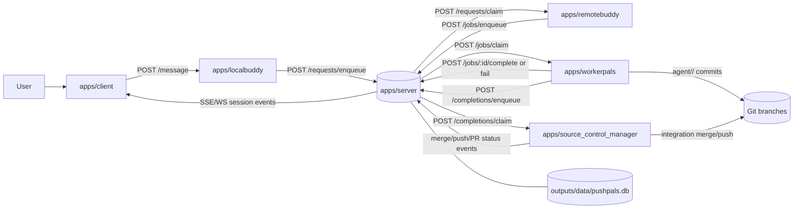

# PushPals

PushPals is a human-guided and autonomous AI coding helper that runs as a multi-service local system around your repository. It combines chat-style interaction, strict planning, delegated execution, and controlled git integration with auditability built in.

## Intent

PushPals is designed for two modes that can coexist in one runtime:

- Human-driven mode: you ask for work in chat, the system plans and executes code changes safely.
- Autonomous mode: `RemoteBuddy` periodically proposes and dispatches bounded maintenance objectives (when policy and eligibility gates allow).

Both modes flow through the same queues, events, and integration pipeline so behavior is observable and debuggable.

## Architecture Visuals

- Excalidraw source: `docs/architecture.excalidraw`
- Mermaid runtime flow:


```mermaid
flowchart LR
  U[User] --> C[apps/client]
  C -->|POST /message| L[apps/localbuddy]
  L -->|POST /requests/enqueue| S[(apps/server)]
  S -->|SSE/WS session events| C

  S -->|POST /requests/claim| R[apps/remotebuddy]
  R -->|POST /jobs/enqueue| S
  S -->|POST /jobs/claim| W[apps/workerpals]
  W -->|POST /jobs/:id/complete or fail| S
  W -->|POST /completions/enqueue| S

  S -->|POST /completions/claim| M[apps/source_control_manager]
  M -->|merge/push/PR status events| S

  S --- DB[(outputs/data/pushpals.db)]
  W -->|agent/<worker>/<job> commits| G[(Git branches)]
  M -->|integration merge/push| G
```

## Services and Responsibilities

- `apps/client`
  - Expo mission-control UI (web/iOS/Android).
  - Subscribes to server event stream and renders live timeline/status.
- `apps/localbuddy`
  - User ingress on `POST /message`.
  - Handles lightweight local responses and status/read-only prompts.
  - Enqueues delegated requests for remote orchestration.
- `apps/server`
  - Central control plane and event hub.
  - Hosts session/event transport, queue APIs, worker heartbeats, and autonomy APIs.
  - Persists all state in SQLite (`outputs/data/pushpals.db` by default).
- `apps/remotebuddy`
  - Planner/orchestrator.
  - Claims queued requests, produces strict planning JSON, emits assistant messages, optionally enqueues `task.execute` jobs.
  - Runs optional autonomy loop for objective ideation/scoring/dispatch.
- `apps/workerpals`
  - Job execution daemon (host worktree mode or Docker mode).
  - Claims jobs, executes backend agent (`miniswe` or `openhands`), streams logs, emits completion records.
- `apps/source_control_manager`
  - Completion consumer and integration daemon.
  - Applies worker output (cherry-pick/no-ff/ff-only), runs checks, pushes integration branch, optionally opens/reuses PR.

## Quick Start

### Prerequisites

- Bun 1.x
- Python 3.12+ (for integration/eval harness and Python executor scripts)
- Docker (recommended; required for default `bun run start` flow)
- Git + GitHub auth if push/PR automation is enabled

### Initial setup

```bash
bun install
cp .env.example .env
cp config/local.example.toml config/local.toml
```

Windows PowerShell:

```powershell
bun install
Copy-Item .env.example .env
Copy-Item config/local.example.toml config/local.toml
```

## Run commands

### Full stack

- `bun run start`
  - Preferred startup path.
  - Runs preflights (config presence, LLM reachability, integration branch/worktree checks, Docker image checks, startup warmup), then launches full stack.
- `bun run start -c`
  - Same as above with runtime-state cleanup first.
- `bun run dev:full`
  - Direct concurrent launcher without the `start.ts` preflight workflow.

### Individual services

- `bun run server:only`
- `bun run localbuddy:only`
- `bun run remotebuddy:only`
- `bun run workerpals:only`
- `bun run workerpals:only:docker`
- `bun run source_control_manager:only`
- `bun run source_control_manager:only:dev`
- `bun run client:only`
- `bun run client:only:offline`
- `bun run web:only`
- `bun run ios:only`
- `bun run android:only`

### Common partial-stack recipes

### Remote agent only (no UI, no LocalBuddy)

Terminal 1:

```bash
bun run server:only
```

Terminal 2:

```bash
bun run remotebuddy:only
```

To feed it work directly:

```bash
curl -X POST http://localhost:3001/sessions -H "Content-Type: application/json" -d '{"sessionId":"dev"}'
curl -X POST http://localhost:3001/requests/enqueue -H "Content-Type: application/json" -d '{"sessionId":"dev","prompt":"Summarize current failing tests","priority":"interactive"}'
```

### Execution path without UI

Terminal 1: `bun run server:only`  
Terminal 2: `bun run remotebuddy:only`  
Terminal 3: `bun run workerpals:only:docker`  
Terminal 4: `bun run source_control_manager:only:dev`

### Local quick assistant only

Terminal 1: `bun run server:only`  
Terminal 2: `bun run localbuddy:only`

## Testing and Evaluation

- `bun run test`
  - Root tests + protocol tests.
- `bun run test:integration`
  - End-to-end integration harness (`tests/integration/integration_controller.py --mode integration`).
- `bun run test:integration:eval`
  - Backend evaluation mode (`--mode eval`) with scenario/budget controls.
- `bun run smoke`
  - Smoke script for startup/stack sanity.

Direct eval wrapper:

```bash
python -u tests/integration/test_workerpals_backend_eval.py
```

Useful eval knobs:

- `WORKERPALS_E2E_BACKENDS=miniswe,openhands`
- `WORKERPALS_E2E_EVAL_SCENARIO_SUITE=quick|real-lite|real-hard`
- `WORKERPALS_E2E_SCENARIOS_PER_BACKEND=1`
- `WORKERPALS_E2E_MAX_TOTAL_SEC=900`
- `WORKERPALS_E2E_MAX_BACKEND_SEC=1200`
- `WORKERPALS_E2E_EVAL_OUTPUT=outputs/workerpals_backend_eval.json`

## Supported Tech

- Runtime/services: Bun + TypeScript (ESM)
- Persistence: SQLite (`bun:sqlite`)
- UI: Expo + React Native + Expo Router
- Worker runtimes: Python 3.12+, Docker sandbox image
- Git integration: git CLI, optional GitHub CLI (`gh`) for auth/PR workflows
- Agent/event protocol: `packages/protocol` JSON schema + TS types
- Shared config/communication: `packages/shared`

## Supported Worker Backends

Configured in `configs/backend.toml` and resolved by `apps/workerpals/src/backends/backend_config.ts`.

- `miniswe` (default)
  - Python executor: `apps/workerpals/src/backends/miniswe/miniswe_executor.py`
  - Uses `mini-swe-agent`.
- `openhands`
  - Python executor: `apps/workerpals/src/backends/openhands/openhands_executor.py`
  - Uses OpenHands SDK / agent-server toolchain.

How to switch:

```toml
# config/local.toml
[workerpals]
executor = "openhands" # or "miniswe"
```

Or via env override:

```bash
WORKERPALS_EXECUTOR=openhands bun run workerpals:only:docker
```

## Supported AI Engines

LocalBuddy, RemoteBuddy, and WorkerPals each have per-service LLM config:

- `LOCALBUDDY_LLM_BACKEND`
- `REMOTEBUDDY_LLM_BACKEND`
- `WORKERPALS_LLM_BACKEND`

Supported backend values:

- `lmstudio`
- `ollama`

Compatibility aliases accepted by config normalizer:

- `openai_compatible` -> `lmstudio`
- `ollama_chat` -> `ollama`

Related settings per service:

- `*_LLM_ENDPOINT`
- `*_LLM_MODEL`
- `*_LLM_API_KEY`
- `*_LLM_SESSION_ID`

## Low-Level Architecture

### 1) Ingress and routing

- Client sends user text to LocalBuddy: `POST /message`.
- LocalBuddy chooses:
  - local reply path for lightweight chat/status/read-only requests, or
  - remote delegation path by enqueuing to server: `POST /requests/enqueue`.
- Explicit remote override command supported in chat: `/ask_remote_buddy ...`.

### 2) Server as control plane

Main server route families in `apps/server/src/server_main.ts`:

- Session/event transport:
  - `POST /sessions`
  - `GET /sessions/:id/events` (SSE replay via `after` cursor)
  - `GET /sessions/:id/ws` (WebSocket replay)
  - `POST /sessions/:id/message`
  - `POST /sessions/:id/command` (auth protected)
- Request queue:
  - `POST /requests/enqueue`
  - `POST /requests/claim`
  - `POST /requests/:id/complete`
  - `POST /requests/:id/fail`
  - `GET /requests`
- Job queue and workers:
  - `POST /jobs/enqueue`
  - `POST /jobs/claim`
  - `POST /jobs/:id/complete`
  - `POST /jobs/:id/fail`
  - `POST /jobs/:id/log`
  - `GET /jobs`
  - `GET /jobs/:id/logs`
  - `POST /workers/heartbeat`
  - `GET /workers`
- Completion queue:
  - `POST /completions/enqueue`
  - `POST /completions/claim`
  - `POST /completions/:id/processed`
  - `POST /completions/:id/fail`
  - `GET /completions`
- Autonomy APIs:
  - lock lifecycle (`/autonomy/lock/acquire|renew|release`)
  - snapshot/objective/outcome/eligibility APIs
  - question lifecycle APIs
- Status/ops:
  - `GET /system/status`
  - `GET /healthz`
  - `POST /admin/shutdown` (auth protected)

### 3) Queue semantics

Both request and job queues are priority ordered:

- `interactive`
- `normal`
- `background`

Queue implementations:

- `apps/server/src/requests.ts`
- `apps/server/src/jobs.ts`
- `apps/server/src/completions.ts`

Shared behavior:

- FIFO within each priority band.
- Claim transitions are atomic.
- Queue position and ETA snapshots are derived from live pending order.
- SLO summaries are derived over rolling windows and exposed by `/system/status`.

### 4) Planner and job contract

RemoteBuddy planner output feeds strict execution payloads.

Worker contract (`task.execute` in job params, schema v2) includes:

- `schemaVersion`
- `lane` (`deterministic` or `worker`)
- `instruction`
- `planning.intent`
- `planning.scope` (read/write bounds)
- `planning.acceptanceCriteria`
- `planning.validationSteps`
- queue/execution/finalization budgets

WorkerPals validates and executes this payload in:

- direct worktree mode, or
- Docker mode via `apps/workerpals/src/docker_executor.ts` and `apps/workerpals/src/job_runner.ts`.

### 5) Integration pipeline

When WorkerPals finishes mutable work:

- completion record is enqueued with commit/branch metadata.
- SourceControlManager claims completion.
- configured merge strategy applies changes into integration branch:
  - `cherry-pick`
  - `no-ff`
  - `ff-only`
- optional checks run.
- integration branch push occurs when enabled.
- optional PR open/reuse is performed when enabled.

SourceControlManager also exposes a localhost status API (`apps/source_control_manager/src/http.ts`):

- `GET /health`
- `GET /jobs`
- `GET /jobs/:id`
- `GET /stats`

### 6) Data model (SQLite)

Main event/session store in `apps/server/src/db.ts`:

- `sessions`
- `events` (append-only cursor log)

Queue + worker tables:

- `requests`
- `jobs`
- `job_logs`
- `job_artifacts`
- `workers`
- `completions`

Autonomy tables in `apps/server/src/autonomy.ts`:

- `autonomy_snapshots`
- `autonomy_candidates`
- `autonomy_objectives`
- `autonomy_outcomes`
- `autonomy_pattern_stats`
- `questions_queue`
- `autonomy_llm_calls`
- `autonomy_dispatch_lock`

### 7) Branch and isolation model

- Source of truth branch: `main`
- Integration branch (default): `main_agents`
- Worker branches: `agent/<workerId>/<jobId>`
- SourceControlManager worktree default: `.worktrees/source_control_manager`
- Worker job execution uses isolated worktrees and optionally isolated Docker runtime.

`scripts/start.ts` enforces critical safety checks before full startup, including:

- required local config files (`.env`, `config/local.toml`)
- LLM endpoint preflight
- integration branch existence/sync checks
- dedicated SourceControlManager worktree guard
- worker sandbox image availability/rebuild policy

## Configuration Model

Canonical config files:

- `config/default.toml`
- `config/<profile>.toml`
- `config/local.toml` (local override, typically gitignored)

Load order (last wins):

1. `config/default.toml`
2. `config/<PUSHPALS_PROFILE>.toml`
3. `config/local.toml`
4. environment variables

High-value env overrides:

- `PUSHPALS_PROFILE`
- `PUSHPALS_SERVER_URL`
- `PUSHPALS_DATA_DIR`
- `LOCALBUDDY_LLM_*`
- `REMOTEBUDDY_LLM_*`
- `WORKERPALS_LLM_*`
- `WORKERPALS_EXECUTOR`
- `WORKERPALS_REQUIRE_DOCKER`
- `WORKERPALS_DOCKER_IMAGE`
- `SOURCE_CONTROL_MANAGER_*`

## Repository Layout

- `apps/client` - Expo UI
- `apps/localbuddy` - user ingress and local routing
- `apps/remotebuddy` - orchestration, planning, autonomy
- `apps/workerpals` - executor daemon and backend adapters
- `apps/source_control_manager` - integration daemon
- `apps/server` - event/queue/autonomy API and persistence
- `packages/protocol` - protocol schemas, types, validators
- `packages/shared` - config loader, communication utilities
- `prompts` - system and planning prompts
- `tests/integration` - e2e + backend eval harness

## Operational Notes

- This repository is under active development.
- For most local development, use Docker worker mode (`workerpals:only:docker`) to keep toolchains reproducible.
- If you only need chat ingress, you can run `localbuddy` without worker services, but delegated coding work requires `server + remotebuddy + workerpals` and usually `source_control_manager` for integration completion.
